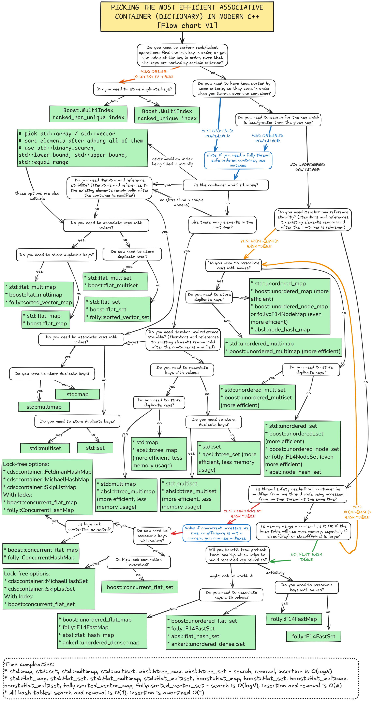

# Choosing the best associative container (dictionary) in modern C++
This flow chart describes an algorithm for picking the most suitable associative container in C++ for various use cases. "Most suitable" means the most efficient while satisfying requirements (such as reference stability or key order).

